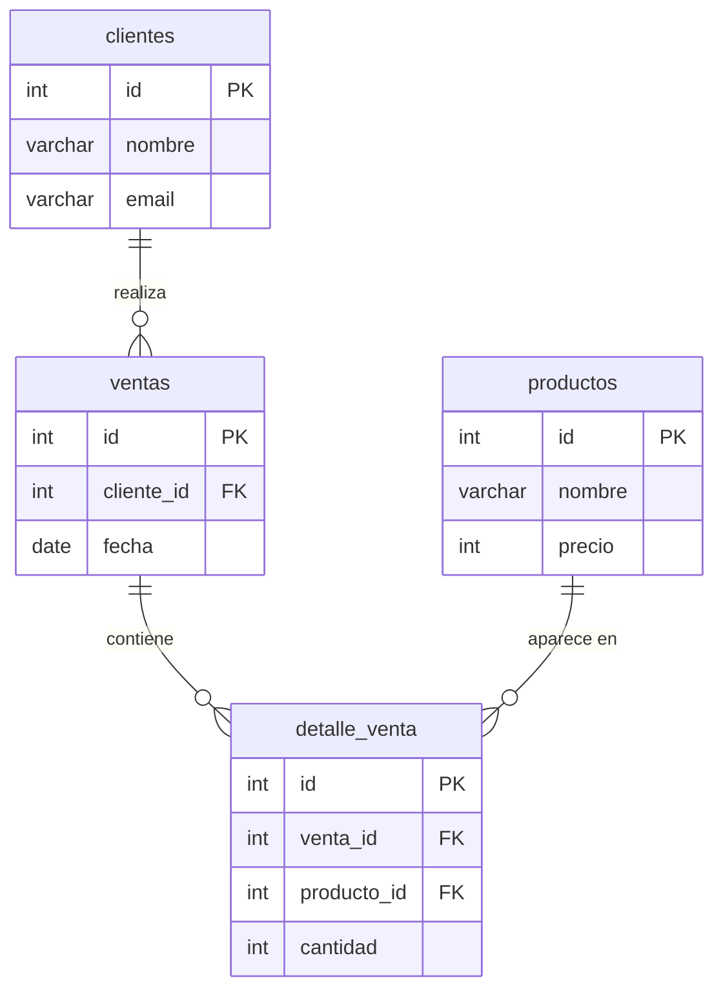

# 🧩 Challenger SQL - Sistema de Ventas

Sistema de base de datos relacional para una tienda de tecnología, desarrollado en PostgreSQL como parte de un desafío grupal de SQL.

---

## 📋 Descripción del proyecto

Este proyecto modela el sistema de ventas de una tienda de tecnología. Permite registrar clientes, productos, ventas y el detalle de cada venta, y responder preguntas reales de negocio como:

- ¿Qué clientes compran más?
- ¿Qué productos se venden más?
- ¿Cuántas ventas se realizan?
- ¿Qué ventas tienen más de un producto?
- ¿Qué clientes han comprado varias veces?

---

## 🛠️ Tecnologías utilizadas

- PostgreSQL 16
- SQL
- Docker
- DBeaver

---

## 📁 Estructura del proyecto

```
sql-sistema-ventas/
│
├── schema.sql   → Crea las tablas de la base de datos
├── seed.sql     → Inserta los datos de prueba
├── report.sql   → Contiene todas las consultas del desafío
└── README.md    → Documentación del proyecto
```

---

## 🚀 Instrucciones de uso

### 1. Levantar la base de datos con Docker

Ejecuta este comando en tu terminal:

```bash
docker run -d --name postgres -e POSTGRES_PASSWORD=postgres123 -e POSTGRES_DB=bootcamp -p 5432:5432 -v postgres_data:/var/lib/postgresql/data postgres:16
```

Esto levanta un contenedor con PostgreSQL 16 y crea automáticamente la base de datos `bootcamp`.

> ✅ No es necesario crear la base de datos manualmente, Docker ya la genera con el parámetro `-e POSTGRES_DB=bootcamp`.

### 2. Conectar DBeaver

Crea una nueva conexión en DBeaver con los siguientes datos:

| Campo | Valor |
|---|---|
| Host | localhost |
| Puerto | 5432 |
| Base de datos | bootcamp |
| Usuario | postgres |
| Contraseña | postgres123 |

### 3. Ejecutar schema.sql

Abre el archivo `schema.sql` en DBeaver y ejecútalo con **F5** o el botón ▶️.

Esto creará las tablas: `clientes`, `productos`, `ventas` y `detalle_venta`.

### 4. Ejecutar seed.sql

Abre el archivo `seed.sql` en DBeaver y ejecútalo con **F5** o el botón ▶️.

Esto insertará los datos de prueba en todas las tablas.

### 5. Ejecutar report.sql

Abre el archivo `report.sql` en DBeaver y ejecútalo con **F5** o el botón ▶️.

Aquí encontrarás todas las consultas del desafío organizadas por nivel.

---

## 🗂️ Modelo de datos

El sistema cuenta con 4 tablas relacionadas entre sí:

| Tabla | Descripción |
|---|---|
| `clientes` | Clientes registrados en la tienda |
| `productos` | Productos disponibles para la venta |
| `ventas` | Registro de cada venta realizada |
| `detalle_venta` | Productos incluidos en cada venta |

---

## 📊 Diagrama ER



---

## 📝 Consultas incluidas en report.sql

| Nivel | Consultas |
|---|---|
| Nivel 1 - Básicas | Consultas simples con SELECT |
| Nivel 2 - Filtros | WHERE y ORDER BY |
| Nivel 3 - Agregaciones | COUNT, AVG, SUM |
| Nivel 4 - JOIN | Relaciones entre tablas |
| Nivel 5 - GROUP BY | Agrupaciones y HAVING |
| Nivel 6 - Trampa | Consulta válida sin resultados |

---

## 👥 Equipo - Escuadron Alpha Mango

| Integrantes |
|---|
| Arantxa Fischer |
| Cristian Diaz |
| Cristopher Contreras |
| Diego Peña |
| Natalia Medel |
| Sabrina Jeria |

Proyecto desarrollado en equipo como parte del Challenger SQL.
